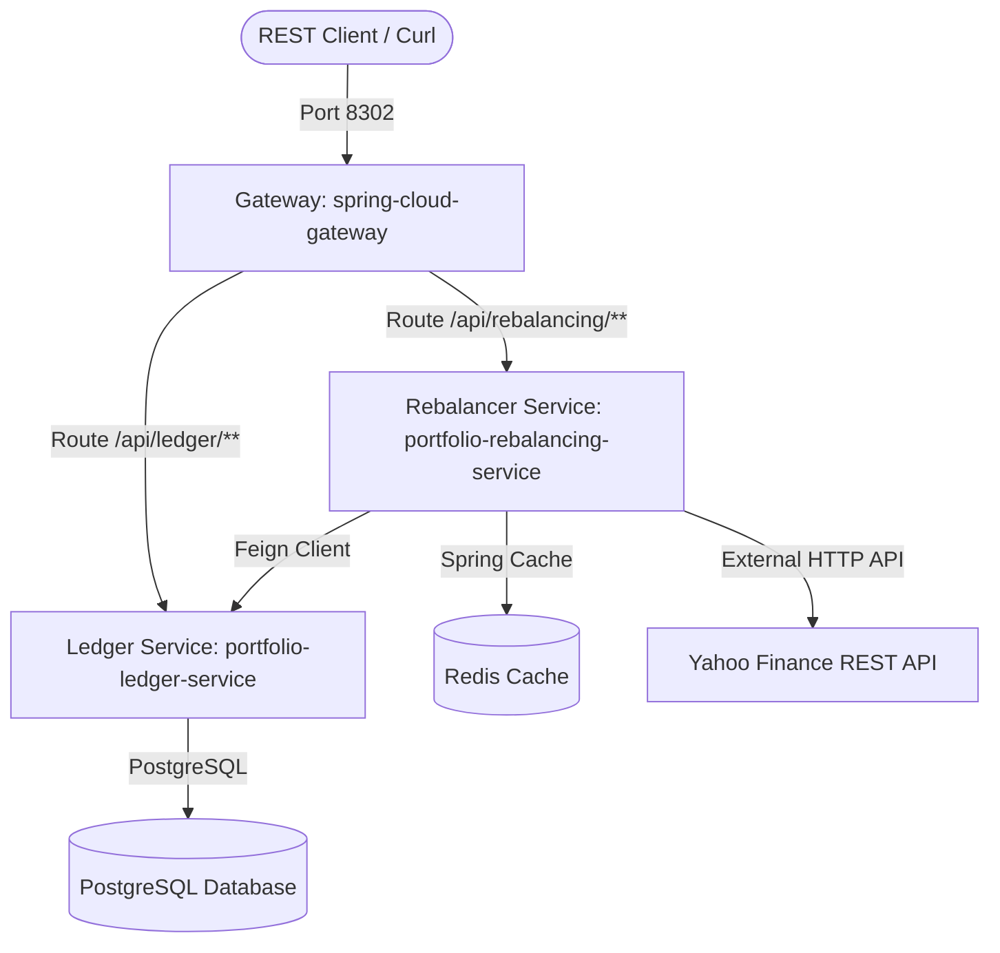

# Portfolio Rebalancing Ledger Stack

This production-grade, containerized Spring Boot microservice suite manages automated asset rebalancing, FIFO tax-lot tracking, and tax-loss harvesting calculations.

---

## 1. System Topology



### Decoupled Core Services:
- **`portfolio-ledger-service`** (Port `8300`): Stores portfolios, transactions, and applies FIFO depletion rules to active `TaxLot` records on SELL operations.
- **`portfolio-rebalancing-service`** (Port `8301`): Calculates portfolio valuations, monitors allocation drift, harvests capital losses (Tax-Loss Harvesting), and manages suggestion executions.
- **`api-gateway`** (Port `8302`): Dynamic API Gateway proxy routing client traffic to services registered in the **Eureka Service Registry** (Port `8761`).

---

## 2. Local Setup (Docker Compose)

Prune persistent database volumes and start the complete microservice stack:
```bash
# Wipe old database volumes
docker compose down -v

# Build and boot the stack in the background
docker compose up --build -d

# Verify container health
docker compose ps
```

---

## 3. End-to-End Core Verification Flow

Run these requests against the API Gateway (`http://localhost:8302`) to test the automated rebalancing flow:

### Step 1: Create a Portfolio
Create a portfolio for user `faiz` with a target allocation of 60% `MSFT` and 40% `AAPL`:
```bash
curl -H "Content-Type: application/json" \
     -d '{"username":"faiz", "name":"Retirement Portfolio", "targetAllocations":{"MSFT": 0.60, "AAPL": 0.40}}' \
     http://localhost:8302/api/rebalancing/rest/portfolio/create
```

### Step 2: Fund the Ledger (Post BUY Transactions)
Establish initial tax lots by registering BUY transactions in the ledger:
```bash
# Buy 10 shares of MSFT at $420.00
curl -H "Content-Type: application/json" \
     -d '{"portfolioId":1, "symbol":"MSFT", "type":"BUY", "quantity":10.0, "price":420.00}' \
     http://localhost:8302/api/ledger/rest/db/transaction/add

# Buy 5 shares of AAPL at $250.00 (High cost-basis lot)
curl -H "Content-Type: application/json" \
     -d '{"portfolioId":1, "symbol":"AAPL", "type":"BUY", "quantity":5.0, "price":250.00}' \
     http://localhost:8302/api/ledger/rest/db/transaction/add
```

### Step 3: Fetch Valuation & Rebalancing Report
Generate a real-time portfolio analysis report containing drift metrics and trade suggestions:
```bash
curl http://localhost:8302/api/rebalancing/rest/portfolio/1/report
```
*Calculates actual weights against target allocations and scans active lots for Tax-Loss Harvesting opportunities.*

### Step 4: Execute a Trade Suggestion
Trigger execution on a generated suggestion by its database ID (e.g. `1`):
```bash
curl -X POST http://localhost:8302/api/rebalancing/rest/portfolio/suggestions/1/execute
```
*Posts the executed transaction to the database ledger and deplets the target tax lots using FIFO logic.*
