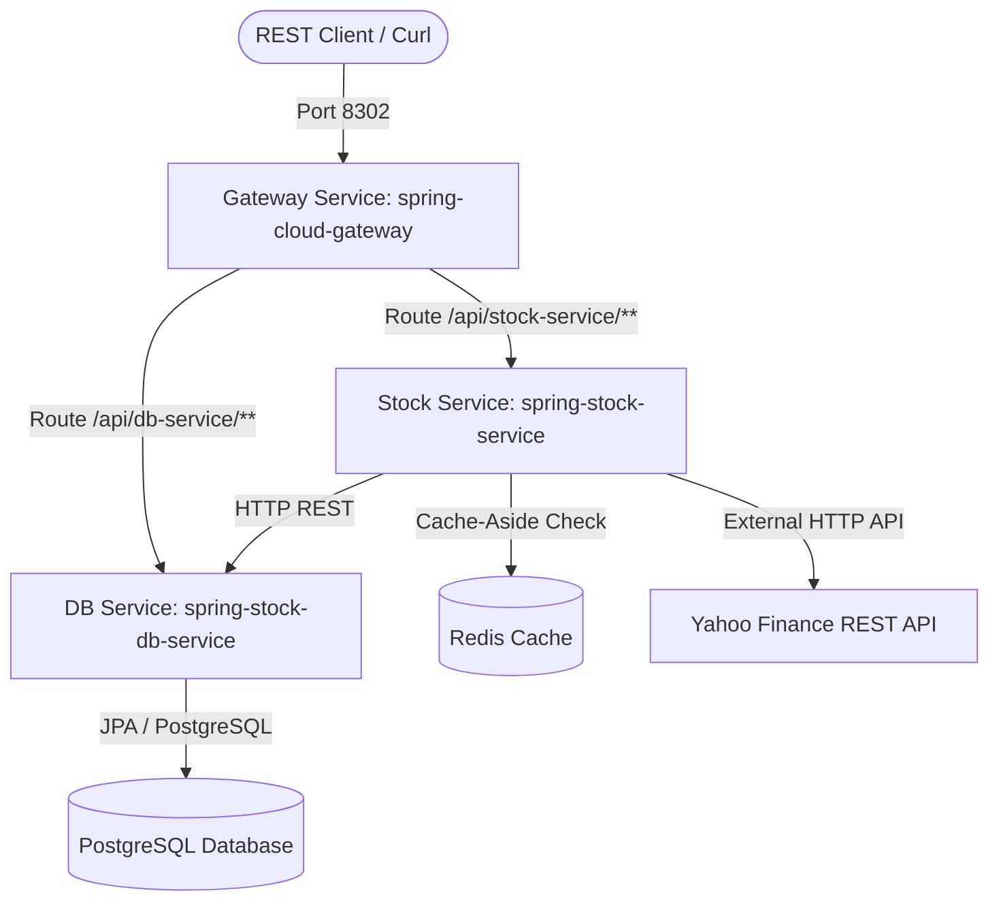

# Spring Stock Microservices & Rebalancing Engine

[](https://github.com/faizalzafri/spring-stock-microservices/actions/workflows/ci.yml)

This production-grade, containerized Spring Boot microservices application serves as an automated **Portfolio Rebalancing and Tax-Loss Harvesting Engine**.

---
## 1. System Architecture

The application is structured into decoupled, containerized services interacting over a secure Docker bridge network:



### Core Engine Design Features:
- **FIFO Ledger Depletion**: BUY transactions establish individual cost-basis `TaxLot` records. SELL transactions automatically locate active lots for that asset, sorted by purchase date ascending, and deplete their remaining quantities chronologically.
- **Allocation Drift Engine**: Computes portfolio value and compares actual weights to target asset allocations. If the absolute drift of any asset exceeds a threshold (e.g. 5%), it generates rebalancing suggestions (BUY/SELL).
- **Tax-Loss Harvesting (TLH)**: Analyzes active tax lots against live market prices. If a lot's current price represents an unrealized loss of 10% or more, a SELL recommendation is created to harvest the capital loss.
- **Redis Cache-Aside**: Fetches market prices from Yahoo Finance JSON API and caches results in Redis with a 10-minute TTL to respect rate limits.
- **Resilience4j Circuit Breaker**: If the market data API is rate-limited or offline, the circuit trips to OPEN, serving graceful, stable mock fallback prices.

---

## 2. Local Development (Docker Compose)

The entire stack (Eureka, Gateway, Redis, PostgreSQL, and backend services) is fully containerized.

### Build and Run
Prune legacy database volumes and run the entire stack in the background:
```bash
# Tear down and purge old volumes
docker compose down -v

# Build and start services
docker compose up --build -d

# Check service health status
docker compose ps

# Monitor service logs
docker compose logs -f
```

### Exposed Endpoints
- **Service Registry (Eureka)**: `http://localhost:8761`
- **API Gateway (Spring Cloud Gateway)**: `http://localhost:8302`

---

## 3. API Verification (Port 8302 Gateway Routing)

### A. Core Portfolio Rebalancing Flow

#### 1. Create a Portfolio
Create a retirement portfolio for user `faiz` with a target allocation of 60% Microsoft (`MSFT`) and 40% Apple (`AAPL`):
```bash
curl -H "Content-Type: application/json" \
     -d '{"username":"faiz", "name":"Retirement Portfolio", "targetAllocations":{"MSFT": 0.60, "AAPL": 0.40}}' \
     http://localhost:8302/api/stock-service/rest/portfolio/create
```

#### 2. Fund the Ledger (Post BUY Transactions)
Post transactions to the database ledger directly to establish initial tax lots:
```bash
# Buy 10 MSFT shares at $420.00
curl -H "Content-Type: application/json" \
     -d '{"portfolioId":1, "symbol":"MSFT", "type":"BUY", "quantity":10.0, "price":420.00}' \
     http://localhost:8302/api/db-service/rest/db/transaction/add

# Buy 5 AAPL shares at $250.00 (Establishes a high cost-basis lot)
curl -H "Content-Type: application/json" \
     -d '{"portfolioId":1, "symbol":"AAPL", "type":"BUY", "quantity":5.0, "price":250.00}' \
     http://localhost:8302/api/db-service/rest/db/transaction/add
```

#### 3. Fetch live Valuation & Analysis Report
Query the portfolio report to see valuations, drift, and trade recommendations. This fetches live Yahoo Finance prices:
```bash
curl http://localhost:8302/api/stock-service/rest/portfolio/1/report
```
*Expected response contains total value, asset weights, absolute drift, rebalancing BUY/SELL recommendations, and tax-loss harvesting candidates (recommending selling the AAPL lot if the current price is < $225).*

#### 4. Execute a Suggestion
Trigger execution on a generated suggestion by its database ID (e.g. `1`):
```bash
curl -X POST http://localhost:8302/api/stock-service/rest/portfolio/suggestions/1/execute
```
*(This logs the transaction to the ledger and performs FIFO depletion on the active tax lots).*

### B. Legacy Quote Management Endpoints

#### Add stock quotes for a user
```bash
curl -H "Content-Type: application/json" \
     -d '{"username":"sam", "quotes":["MSFT", "AAPL"]}' \
     http://localhost:8302/api/db-service/rest/db/add
```

#### Retrieve stock price valuations (via Cache-Aside)
```bash
curl http://localhost:8302/api/stock-service/rest/stock/sam
```

---

## 4. Resilience Testing (Circuit Breaker)

Verify the Resilience4j Circuit Breaker fallback mechanism.

### Simulate database outage
Stop the database service:
```bash
docker compose stop db-service
```

### Fetch quotes (Triggers Fallback)
```bash
curl http://localhost:8302/api/stock-service/rest/stock/sam
```
*Expected response (graceful mock cached fallback):*
```json
[
  {"quote":"FALLBACK-MSFT","price":420.59},
  {"quote":"FALLBACK-AAPL","price":185.75}
]
```

---

## 5. Continuous Integration (CI)

A GitHub Actions workflow is defined in `.github/workflows/ci.yml` to compile and verify all services.

### Local Workflow testing (via Act CLI)
To test the workflow on your local machine using Docker:
```bash
# Install Act CLI (Windows)
winget install nektos.act

# Run the workflow locally
act
```

---

## 6. Kubernetes Orchestration

Production manifests are located in the [k8s/](file:///E:/Dev/spring-stock-microservices/k8s) folder.

### Dry-run validation
```bash
kubectl apply -f k8s/ --dry-run=client --validate=false
```

---
> **AI Generated README.md**
